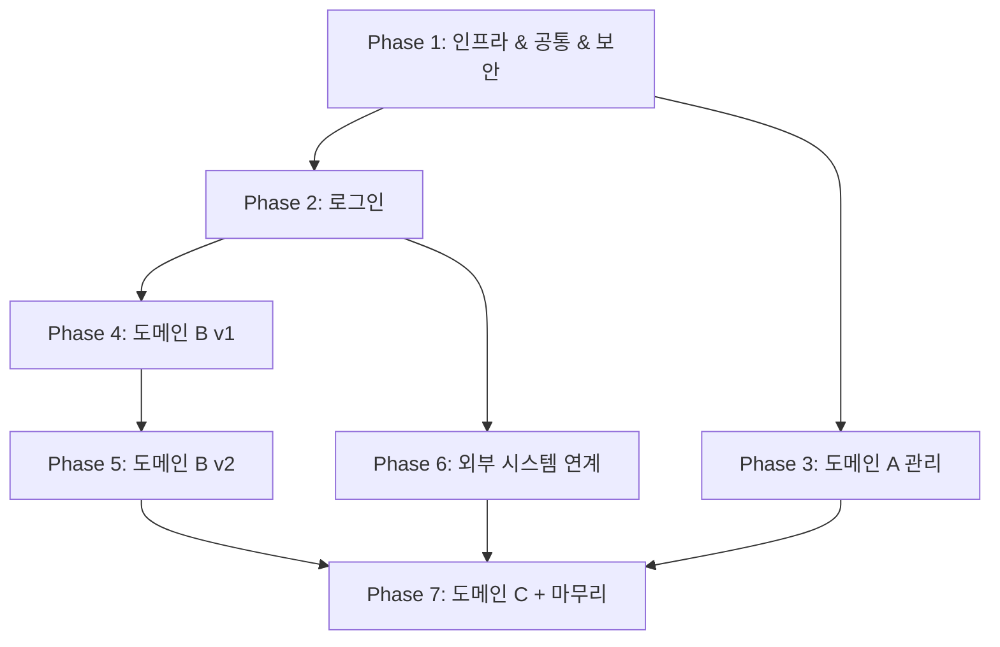

# Root Document Schema — 6단계

> dev-planner 6단계 루트 문서 출력 schema 단일 출처.
> 문체는 **전보체**(명사구 종결·1항목 1줄) — 단일 출처 `docs/agents/common/artifact-style.md`. 분량 상한이 아니다.

---

## 6단계: 루트 문서 생성

**경로:** `{workspace_root}/{{config.outputDir}}/plans/{task_number}/{task_number}_dev_plan.md`

디렉토리가 없으면 생성:
```bash
mkdir -p "{workspace_root}/{{config.outputDir}}/plans/{task_number}/phases"
```

**루트 문서 스키마 (frontmatter + 10섹션):**

> **frontmatter 는 기계가 읽는 계약이다.** `plan-loader` 가 `.claude/skills/plan-loader/scripts/plan-manifest.mjs` 로 결정론 추출한다
> (자유형식 표 파싱도, 슬러그로 영역을 추측하는 일도 하지 않는다). 아래를 지킨다:
>
> - `task`·`brief`, 각 페이즈의 `id`·`slug`·`area`·`project`·`file` 은 **필수**. 누락하면 검증이 실패한다.
> - `area` 는 `BE` 또는 `FE` 만 쓴다. 슬러그로 유추하게 두지 말고 명시한다.
> - `project` 는 `project.yaml projects[].name` **하나**(문자열)다. 배열 금지. 런타임이 페이즈를 이 프로젝트 하나에 영구 바인딩하므로, 두 프로젝트에 걸치는 페이즈는 R-P 위반이다 — 프로젝트별로 나눈다. 값은 §3-1 Primary 표의 프로젝트 열에 있어야 한다.
> - `depends` 는 실제로 존재하는 `id` 만 가리킨다.
> - 배열은 인라인(`[1, 2]` · `[]`)으로 쓴다. 블록 리스트(`- 1`)는 파서가 받지 않는다.
> - 진행 상태·재시도 횟수 같은 **실행 상태는 여기 쓰지 않는다.** 계획서는 계약이고, 상태는 별도 파일이다.

````markdown
---
task: "{과업번호}"
brief: {{config.outputDir}}/{과업번호}_dev_brief.md
phases:
  - id: 1
    name: {페이즈명}
    slug: {slug}
    area: BE
    project: {projects[].name}
    brief_steps: [1, 2, 3]
    estimate: 3d
    depends: []
    deployable: true
    file: phases/phase-1-{slug}.md
  - id: 2
    name: {페이즈명}
    slug: fe-{화면}
    area: FE
    project: {projects[].name}
    brief_steps: [4, 5]
    estimate: 2d
    depends: [1]
    deployable: true
    file: phases/phase-2-fe-{화면}.md
    screens: [{화면 id}, ...]
    anchors: [{요구사항 앵커 id}, ...]
---

# 개발 계획서 — {과업번호} {주제}

## 1. 플랜 메타
| 항목| 값|
|------|-----|
| 브리프 파일| {브리프 절대경로}|
| 브리프 품질 등급| HIGH/MEDIUM/LOW (브리프 §1에서 전이)|
| 플랜 생성일| {YYYY-MM-DD}|
| 계획자| {dev-planner 자동 생성}|
| 브랜치 전략| 페이즈별 분기 — 각 페이즈 §1 `제안 브랜치` 참조. 상세는 §10 참조|
| 총 페이즈 수| N|
| 총 예상 기간| {Nd} (브리프 §1 참조)|

## 2. 작업 개요
| 항목| 값|
|------|-----|
| 개발 유형| 신규/확장 (브리프 §2)|
| 프로젝트 유형| (브리프 §2)|
| 프로젝트명| {project_root}|
| 베이스 패키지| (브리프 §2)|
| 배포 포맷| JAR/WAR|
| 빌드| 빌드 도구 단일/멀티|

## 3. 스코프 & 접근 범위
### 3-1. Primary (쓰기 대상)
| 프로젝트| scope| allowedPaths| 비고|
|---------|------|-------------|-----|
| {projects[].name}| {scope.yaml id}| {allowed_paths}| scope.yaml 매칭 결과 / 사전 준비 제안서 §2 `Code home` Target + "사전준비 A-x 등재 대기" / "신규 프로젝트 — 본 계획 승인 후 등재 필요"|

> 쓰기 대상 프로젝트마다 1행 — 변경이 있는 Related 프로젝트(§3-2 변경 유무 = 변경)도 여기 들어온다. 페이즈 frontmatter `project` 는 이 표의 프로젝트 열 값 중 하나여야 한다 (plan-auditor PA-SCOPE 대조 기준).

### 3-2. Related — 호출 대상 (읽기·참조)
| 프로젝트| 역할| 영향도| 변경 유무|

### 3-3. Related — 패턴 참조
| 프로젝트| 참조 용도|

### 3-4. 가이드라인 참조
- {guide-files 목록}
- {project_root}/CLAUDE.md (기존 프로젝트)

## 4. 전제·가정 (Open Questions → 플랜 시점 가정)
브리프 §9 미결사항을 **"현 시점 이렇게 가정한다"** 선언으로 전환:

| #| 가정| 근거/예비 해결 경로| 검증 페이즈|
|---|------|------------------|----------|
| 1| 행안부 가이드 v0.2 기준 진행| 개정판 수신 시 별도 PR| Phase 3 완료 전|
| ...|

> **브리프 §9가 비어있거나 미결사항이 없으면** 표를 `| —| 해당 없음| —| —|` 단일 행으로 기록한다. 섹션 자체를 생략하지 않는다 (플랜 스키마 일관성 유지).

**사전 준비 제안서(`{과업번호}_dev_prepare.md`)가 입력에 있으면** 그 §4 「계획 전제」를 이 표에 **항목 ID 로** 옮긴다 — 실행문·판단 근거는 그 문서가 소유하므로 다시 쓰지 않는다:

| #| 가정| 근거/예비 해결 경로| 검증 페이즈|
|---|------|------------------|----------|
| 1| 사전준비 A-1·A-2 완료 (신규 테이블·설정 반영)| 사전준비 제안서 §2 — 미반영이면 착수 불가| Phase 1 착수 전|
| 2| 사전준비 B-3 채택 — 월 집계는 운영 수동 처리| 사전준비 제안서 §3 (사람 승인 완료)| 해당 없음 (개발 대상 아님)|
| 3| 사전준비 A-3 **미완료** — 보관 기간 미확정| 사전준비 제안서 §2 — 값 확정 후 반영| Phase 2 DoD|

- 완료 전제인 A항목은 **개발 Task 로 만들지 않는다.** §5 페이즈에 "테이블 생성" Task 가 생기면 그 단계를 돌린 의미가 사라진다.
- 미완료(☐) BLOCKING 항목은 위 3번처럼 "미완료" 를 명시하고, 그 항목에 의존하는 페이즈를 후순위로 둔다.
- §9 위험·리스크 표에도 같은 ID 로 리스크를 남긴다 (예: `사전준비 A-1 미반영| 중| 고| 착수 전 DBA 반영 확인| 1`).

## 5. 페이즈 목록 & 의존성 그래프

### 5-1. 페이즈 테이블

> **frontmatter `phases[]` 가 단일 출처다.** 같은 내용을 여기 표로 다시 적지 않는다 —
> 두 곳에 적으면 반드시 어긋나고, 어긋났을 때 어느 쪽이 맞는지 판정할 방법이 없다.
> 사람이 읽을 요약이 필요하면 페이즈 **수**와 총 기간만 한 줄로 쓴다 (§1 플랜 메타와 중복되지 않는 선에서).

### 5-2. 페이즈 분할 근거
| 규칙| 적용 예시|
|-----|---------|
| R1 스캐폴딩+공통+보안 통합| 원본 §11 1·2·3단계를 Phase 1로|
| R2 v1/v2 분리| 도메인 B v1 → Phase 4 / 도메인 B v2 → Phase 5 (버전별 독립 페이즈)|
| R3 신규 도메인 독립| 도메인 C(§11 12) → Phase 7|
| R4 0.5d 흡수| 이력 조회(§11 10) → Phase 3 도메인 A에 흡수 / 알림(§11 11) → Phase 4 도메인 B v1에 흡수|
| R9 화면 1:1| Phase 2~7을 FE 화면별로 분할 (화면 1개 = 1페이즈, 묶지 않음)|
| ...|

### 5-3. 의존성 그래프

페이즈 수가 5개 이하면 텍스트 다이어그램, 6개 이상이면 mermaid 권장:

**페이즈 ≤ 5 (텍스트):**
```
Phase 1 → Phase 2 → Phase 3
 ↘ Phase 4 ─→ Phase 5
```

**페이즈 ≥ 6 (mermaid):**


## 6. 공통 상수·Enum·DTO 정의 (글로벌)
브리프 §5 코드값 사전 + §6 외부 통신 스펙을 Java 수준 설계안으로 변환:

### 6-1. Enum/열거형 설계안
```
// 언어팩 컨벤션에 따라 작성
ApplyStatus {
 APPLIED    = "A"  // 신청
 CONFIRMED  = "F"  // 확정
 GIVEN      = "G"  // 지급완료
 GIVE_FAILED = "E" // 지급실패
}
```

### 6-2. 상수 설계안
```
// 언어팩 컨벤션에 따라 작성
AppConstants {
 RD_SE_FIRST  = "1D"
 RD_SE_SECOND = "2D"
}
```

### 6-3. DTO 목록 (필드 명세는 페이즈 §4)

> **DTO 필드 표의 단일 출처는 BE 페이즈 §4-X 다. 여기 다시 적지 않는다** — §5-1 과 같은 이유다.
> 같은 표를 두 곳에 적으면 반드시 어긋나고, 어긋났을 때 어느 쪽이 맞는지 판정할 방법이 없다.
> 예전 스키마는 루트에 전량 표를 두고 "페이즈 문서를 쓸 때 루트를 동시 갱신할 책임" 을 dev-planner 에
> 지웠는데, 그 동시 갱신이 곧 드리프트의 정의였다.

루트는 지도이므로 **어떤 DTO 가 있고 어느 페이즈가 그 계약을 소유하는지**까지만 적는다. 필드·타입·검증은 그 페이즈 문서에 있다.

| DTO| 종류| 계약 소유 페이즈| 소비 페이즈|
|-----|-----|----------------|----------|
| {RequestDTO 클래스명}| Request| phase-{N} (BE)| phase-{M} (FE)|
| {ResponseDTO 클래스명}| Response| phase-{N} (BE)| phase-{M} (FE)|

BE/FE 정합은 페이즈 문서 사이에서 맞춘다 — FE 페이즈 §4-N 화면 input 표가 BE 페이즈 §4-X 를 참조해 필드명을 일치시키고, 검증은 FE ≤ BE 로 둔다(BE 가 최종 게이트). 규칙 본문은 `phase-doc-schema.md` §4 단일 출처.

### 6-4. 응답코드 매핑
| 외부 응답| 내부 처리| 사용 페이즈|
|---------|---------|----------|
| 100 기신청| 안내 모달| Phase 3|
| 400 이의신청 대상| 이의신청 플로우 분기| Phase 3 → Phase 7|

## 7. 외부 연동 공통 스펙 (글로벌)
브리프 §6 외부 통신 스펙을 코드 수준 구현 지침으로:

| 연동| 구현 클래스 (제안)| 사용 Util| 의존 Config| 사용 페이즈|
|-----|---------------|---------|----------|----------|
| ext-api 전문| `InnerApiManager`| `SeedUtil`, `HmacSHA256Util`| `RestTemplateConfig`| 3,4,5,7|
| saleoffice SSO| `SaleofficeSsoManager`| `HmacSHA256Util`| —| 5|
| 주민번호 보안키패드| `KeypadService`| —| `SecurityConfig`| 1,3|
| 세션| —| —| `RedisConfig`| 1|
| 분산 추적| `TrackingFilter`| —| MDC| 1|

## 8. 재사용 자산 매핑 (글로벌)
브리프 §10 + 구체적 사용 페이즈 매핑:

### 8-1. 라이브러리
| 라이브러리| 버전| 용도| 사용 페이즈|

### 8-2. 참조 코드 패턴
| 원본 경로| 이식 후 경로| 사용 페이즈|

### 8-3. 공통 모듈·설정
- `ResponseTemplate`, `ResponseCode`, `GlobalExceptionHandler` 등 (Phase 1에서 이식)

## 9. 위험·리스크
| 리스크| 확률| 영향| 완화책| 관련 페이즈|
|-------|-----|-----|------|----------|
| 행안부 API 스펙 개정 중| 중| 고| Phase 3 구현 전 재확인| 3, 4|
| 외부 코드 이식 중 누락| 중| 중| Phase 7 E2E로 검증| 7|
| 신규 테이블 DDL 미승인| 중| 고| DBA 리뷰 Phase 7 착수 전| 7|

## 10. 커밋/배포 전략

> **base-rule.md 컨벤션 확장 안내**
> base-rule.md의 원칙 feature 브랜치명은 `feature/{과업번호}/{userId}` 3-segment 구조다.
> 페이즈 단위 점진 배포를 위해, **두 번째 segment를 `{과업번호}-phase{N}-{slug}` 컴파운드로 확장**하여 3-segment 구조는 유지한다. 다른 규칙(커밋 타입·MR 흐름)은 base-rule.md 그대로 따른다.

- **페이즈별 브랜치**: `feature/{task_number}-phase{N}-{slug}/{userId}` (예: `feature/055-phase1-infra/bcj408`)
- **부모 브랜치**: release 브랜치(`release-{yyyy.MM.dd}-v{N}`) 하위에서 분기
- **페이즈별 PR**: 각 페이즈 완료 시 MR → release 브랜치
- **커밋 메시지 컨벤션** (`.claude/rules/base-rule.md` §7 *Git Commit 메시지 컨벤션* 준수 — 단일 출처는 `/git` 스킬의 `commit-convention.md`):
 - `ADD : ... (#feature/{task_number}-phase{N})`
 - `CHANGE : ... (#feature/{task_number}-phase{N})`
- **배포 단위**: 페이즈 단위 점진 배포. frontmatter `deployable: true` 인 페이즈만 단독 배포. `false` 는 선행 페이즈와 묶어서 배포.
- **롤백 기준**: 페이즈 종료 신호 미달성(BE = 빌드 도구 테스트 RED, FE = sub-agent 코드 생성 실패) 또는 기능 검증(qa-planner §5-2) 통과 실패 시 해당 페이즈 브랜치 revert PR 생성.
````
